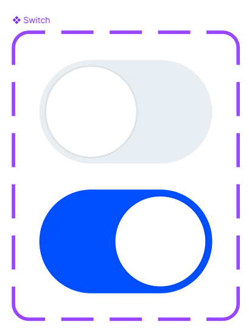
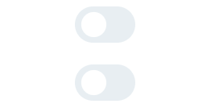
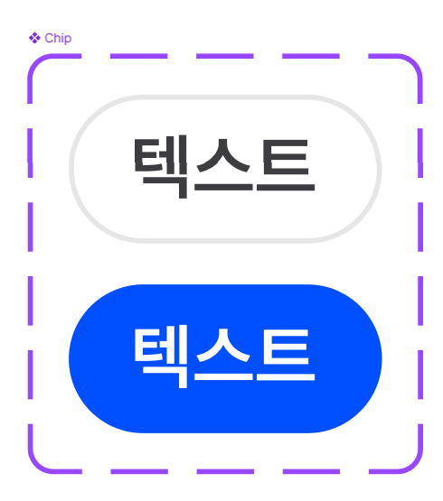
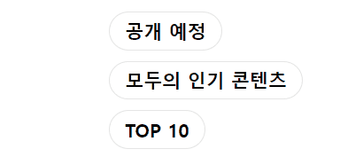
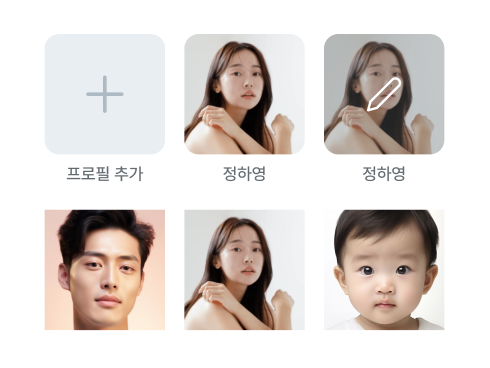
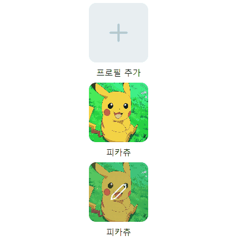
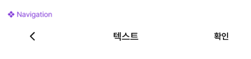
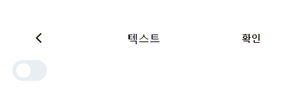

# UI Development Practice

멋사 프론트엔드 스쿨 12기 공세현의 1주차 과제 문서입니다.😀

- [🔗UI Development Practice 배포 링크](https://kongsh.github.io/likelion-react-homework/)

## 📝 목차

- [Switch](#switch)
  - 분석
  - 과정 및 결과
- [Chip](#chip)
  - 분석
  - 과정 및 결과
- [Profile](#profile)
  - 분석
  - 과정 및 결과
- [Navigation](#navigation)
  - 분석
  - 과정 및 결과
- [후기](#후기)

## Switch



### 분석

- 클릭했을 때 토글되어야 하며, `input` 태그의 `type="checkbox"`를 활용해봐야겠다고 생각했습니다.
- `input::before`으로 원형의 토글 버튼을 만들고 싶었습니다.
- `id`와 `labelText` 값을 받아서 각각 `input`의 `id`, 접근성을 고려해 `label`에 들어갈 `Text`에 사용하려고 했습니다.

### 과정 및 결과

```ts
import React from "react";

const { createElement: h } = React;

interface Switch {
  id: string;
  labelText: string;
}

export default function Switch({ id, labelText }: Switch) {
  return h(
    "div",
    {
      className: "switch",
    },
    h(
      "label",
      null,
      h("span", { className: "sr-only" }, labelText),
      h("input", {
        role: "switch",
        type: "checkbox",
        id,
      })
    )
  );
}
```



- 스크린 리더만이 읽을 수 있도록 `label`의 `children`에 `labelText`를 넣었습니다.
- 스위치의 기능을 하기 때문에 `input`의 `props`에 `role="switch"`를 추가했습니다.
- 상위 컴포넌트(`App`)에서 하위 컴포넌트(`Switch`)를 불러오는 것을 0부터 스스로 개발해보며 리액트에 적응해 나가고 있습니다.

## Chip



### 분석

- 칩 UI를 바닐라 프로젝트 때 `button`으로 만들어 봤기 때문에 이번엔 `Switch`와 동일하게 `input`의 `checkbox`를 활용해 개발해 보려고 했습니다.

### 과정 및 결과

```ts
interface Chip {
  id: string;
  labelText: string;
}

export default function Chip({ id, labelText }: Chip) {
  return h(
    "div",
    {
      className: "chip",
    },
    h(
      "label",
      null,
      h("input", {
        type: "checkbox",
        id,
      }),
      h("span", null, labelText)
    )
  );
}
```



- `Switch`와 거의 유사한 구조라서 `TS` 코드는 어렵지 않게 만들 수 있었습니다.
- `CSS` 스타일링을 할 때 `label`이 자꾸 `div` 밖으로 빠져나와서 어려움을 겪었는데, 기존에 제가 `<input>` 에 작성했던 `transition = translate`를 삭제하고 `top`,`left` 값을 조절하니 원하는 대로 고칠 수 있었고, 이 경험을 통해 성장하고 있음을 느꼈습니다.

## Profile



### 분석

- 3개의 상태가 존재하는데, 각각 `프로필 추가`, `프로필`, `프로필 수정` 상태일 것이라고 분석했습니다.
- 위의 이미지가 들어갈 공간은 `a` 태그로 만들어 안에 `img`가 들어갈 수 있도록 했고, 클릭했을 때 각각의 상태에 맞는 링크로 들어가야 한다는 생각을 했습니다.

### 과정 및 결과

```ts
interface Profile {
  href?: string;
  userName?: string;
  userImg?: string;
  edit?: boolean;
}

interface ImgProps {
  alt: string;
  src: string;
  className?: string;
}

export default function Profile({ href, userName, userImg, edit = false }: Profile) {
  // 유저 이름, 이미지, 유저 프로필 링크를 DB에서 받았는지 확인
  const isValid = userName && userImg && href;

  // 기본 값 설정
  let imgProps: ImgProps = {
    alt: "프로필 추가",
    src: "assets/profile-plus.svg",
    className: "profile-add",
  };

  if (isValid) {
    delete imgProps.className;

    imgProps = {
      alt: `${userName} 프로필${edit ? " 수정" : ""}`,
      src: userImg,
    };
  }

  return h(
    "div",
    { className: "profile" },
    h(
      "a",
      {
        // href: href ? href : "프로필 추가 사이트로 가는 링크",
        href: href ? href : "#",
      },
      h("img", imgProps),
      edit
        ? h("img", {
            className: "edit",
            "aria-hidden": true,
            src: "assets/profile-edit.svg",
          })
        : null
    ),
    h("p", { "aria-hidden": true }, isValid ? userName : "프로필 추가")
  );
}
```



- `edit` 값은 해당 `Profile` 컴포넌트가 프로필 수정 상태인지를 나타냅니다. 이는 `프로필 수정`상태와 그렇지 않은 것을 분기합니다.

- `href`, `userName`, `userImg`, `edit` 값을 필수가 아닌 선택적으로 받았고, `edit`을 제외한 나머지 값들이 하나라도 없을 경우, `isValid`를 통해 메인 `img`에 기본 값이 적용되어 `프로필 추가`와 `프로필`상태를 분기 했습니다.

- 처음엔 `edit`의 `T/F` 여부에 상관없이 `edit img` 태그를 만들어 놓고 `hidden` 처리 했지만, 나중에 생각해보니 렌더링 될 때 쓰이지 않는 태그를 만드는 것이 비효율적일 것이라고 판단해 `edit` 값이 참일때만 `edit img` 태그를 만들 수 있도록 하였습니다.

- 또, `edit`과 `span`에 `aria-hidden`을 사용해 스크린 리더가 반복되거나(`span`) 필요없는(`edit`) 정보를 읽지 않도록 했습니다.

- 프로필 추가와 수정에 `svg` 코드를 그대로 가져와 아이콘을 넣으려고 시도했으나, 잘 풀리지 않았고 시간상 여유가 없어 `img`에 `svg` 파일을 경로로 불러와 사용한 상태입니다.😥 다음 회고나 자습 시간때 재시도 해볼 생각입니다.🔥

## Navigation



### 분석

- 양 끝의 버튼 2개와 제목을 담당하는 `h1`태그를 `nav`로 감싸 구현할 계획입니다.

### 과정 및 결과

```ts
interface Navigation {
  confirmButtonId: string;
  headerText: string;
}

export default function Navigation({ confirmButtonId, headerText }: Navigation) {
  return h(
    "div",
    { className: "navigation" },
    h(
      "nav",
      null,
      h(
        "button",
        { type: "button", "aria-label": "뒤로 가기" },
        h("img", {
          src: "assets/left-angle.svg",
          alt: "뒤로 가기",
        })
      ),
      h("h1", null, headerText),
      h("button", { type: "button", id: confirmButtonId }, "확인")
    )
  );
}
```



- 인자로 `headerText`(헤더에 들어갈 문자열), `confirmButtonID`(확인 버튼의 ID값)을 받아옵니다.
- 분석한 대로 구현에 성공했고, `Profile`처럼 `svg`파일을 `img`에 불러와 구현했습니다.

## 후기

- `React`의 첫 과제인 만큼 `React`의 개념과 구조, 사용 방식에 익숙해져야겠다고 생각하고 과제에 임했는데, 그 목적은 잘 달성한 것 같습니다.
- 강사님께서 말씀해주신 `React` 사이트의 리액트 시작하기를 미리 읽어봤었고, 그래서 과제를 하면서 `jsx`를 쓰면 편해질 것 같다는 생각이 들었습니다.
- 생각보다 배포와 그에 맞는 상대/절대경로 값 수정에 시간을 좀 썼지만, 지금은 방법을 찾고(`gh-pages` 패키지 활용) 익숙해져서 다음 과제를 할 때는 편하게 할 수 있겠다고 생각했습니다.
