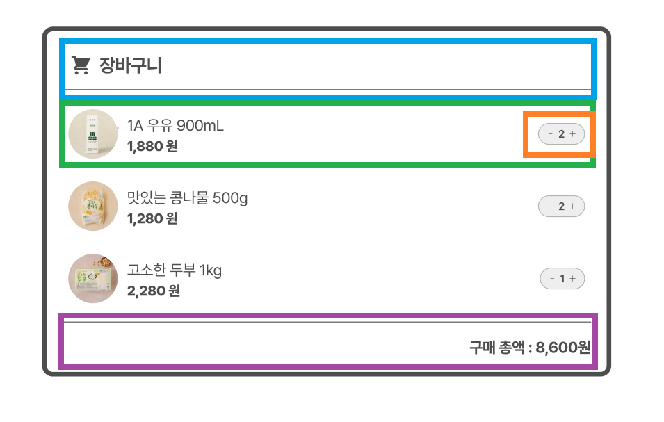
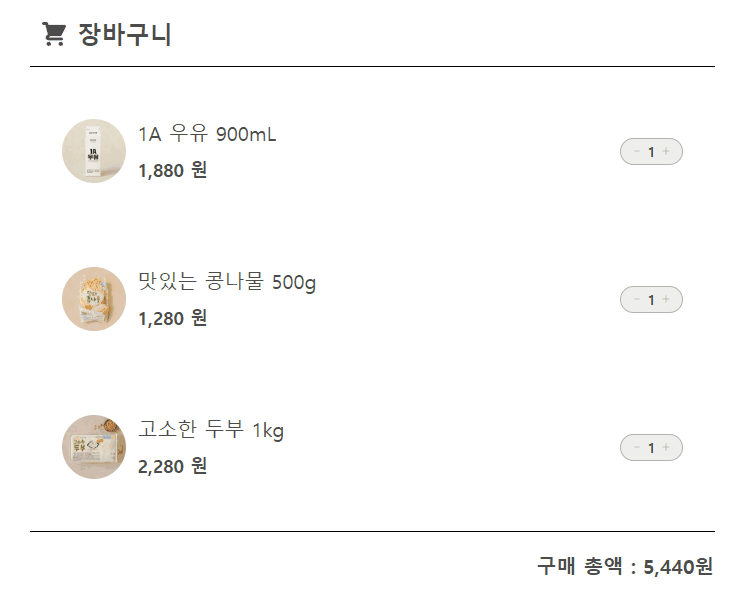

# 장바구니 UI

멋사 프론트엔드 스쿨 12기 공세현의 5주차 과제 문서입니다.😀

- [🔗장바구니 UI 배포 링크](https://kongsh.github.io/likelion-react-homework/?view=week5)

## 📝 목차

- [설계](#설계)
- [과정](#과정)
- [결과물](#결과물)
- [후기](#후기)

## 설계



- <span style="color:skyblue">CartHeader</span>, <span style="color:purple">CartFooter</span>, <span style="color:green">ProductList</span>를 포함하는 `Cart` 컴포넌트에서 상태를 관리합니다.
- `Props`로 리스트 렌더링 된 `ProductList`와 `CartFooter`에 파생된 상태, 상태, 이벤트 핸들러 함수를 넘겨줍니다.

---

```ts
const PRODUCTS = [
  {
    id: "item-1",
    productName: "1A 우유 900mL",
    price: 1880,
    productImg: "assets/week5/milk.png",
    maxCount: 3,
  },
  {
    id: "item-2",
    productName: "맛있는 콩나물 500g",
    price: 1280,
    productImg: "assets/week5/bean.png",
    maxCount: 5,
  },
  {
    id: "item-3",
    productName: "고소한 두부 1kg",
    price: 2280,
    productImg: "assets/week5/tofu.png",
    maxCount: 4,
  },
];

const INITIAL_PRODUCTS_COUNT = [1, 1, 1];
```

- 데이터들은 위와 같이 선언하여 `Cart` 컴포넌트에서만 직접 접근하도록 설계했습니다.

## 과정

```ts
function Cart() {
  const [counts, setCounts] = useState(INITIAL_PRODUCTS_COUNT);

  const totalPriceNumber = PRODUCTS.reduce((acc, { price }, index) => {
    const count = counts[index];

    return acc + price * count;
  }, 0);
  const totalPrice = totalPriceNumber.toLocaleString();

  const handleIncrease = (i: number) => {
    const nextCounts = [...counts].map((item, index) => {
      if (index === i && PRODUCTS[i].maxCount !== counts[i]) {
        return item + 1;
      }
      return item;
    });

    setCounts(nextCounts);
  };

  const handleDecrease = (i: number) => {
    const nextCounts = [...counts].map((item, index) => {
      if (index === i && counts[i] > 1) {
        return item - 1;
      }
      return item;
    });

    setCounts(nextCounts);
  };

  return (
    <div className="p-5">
      <CartHeader />
      <ul className="flex flex-col gap-5 my-5">
        {PRODUCTS.map(({ productName, productImg, price, id }, index) => (
          <li key={id}>
            <ProductList productName={productName} price={price} productImg={productImg} count={counts[index]} maxCount={PRODUCTS[index].maxCount} handleIncrease={() => handleIncrease(index)} handleDecrease={() => handleDecrease(index)} />
          </li>
        ))}
      </ul>
      <CartFooter totalPrice={totalPrice} />
    </div>
  );
}
```

- `Cart` 컴포넌트에서 상태 `counts`를 관리
- 핸들러 함수에서 변경 가능한 `count`값의 최대/최소에 따라 조건문 처리
- `ProductList` > `Counter` 컴포넌트로 `props`를 통해 핸들러 함수, 카운터 값 전달
- `CartFooter`에 물품 가격의 총합을 전달

## 결과물



- 장바구니 UI를 구현 완료했습니다.

## 후기

- 강의 시간에 보여주셨던 `Nav`, `NavLink` 컴포넌트를 활용해서 주차별 과제 렌더링을 스스로 구현해보며 복습했습니다.
- 강의 시간에 배운 `tailwindcss`로 스타일링을 해보니 `.css` 파일을 왔다갔다하지 않아도 되어 확실히 편했습니다.
- 상태 관리를 할 때, 두 배열(상품 정보 배열, `counts` 배열) 중 같은 `index`이면 같은 상품임을 암묵적으로 생각하고 단순히 `counts` 배열을 `[1,...]`의 방식으로 만들어 개발을 끝냈는데, 그보다 `[{id, count}, ...]` 방식의 배열로 하는 것이 유지보수에 더 좋았을 것이라고 생각이 들었습니다.
- 강의 시간에 배운 상태 설계, 접근성(`counter` 컴포넌트의 `aria-disabled`), 그외의 많은 것들을 복습해보며 익힐 수 있어 좋았습니다.
