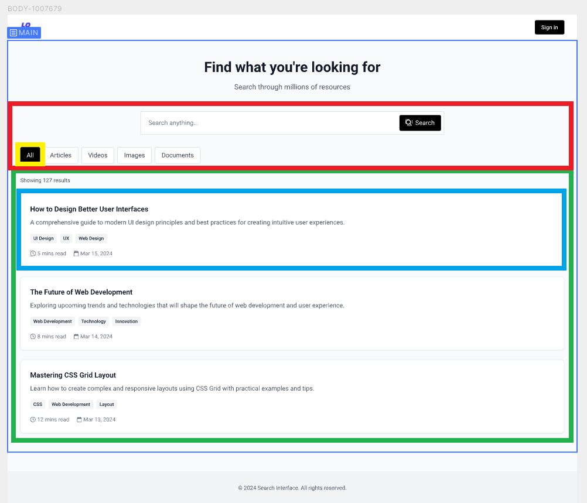
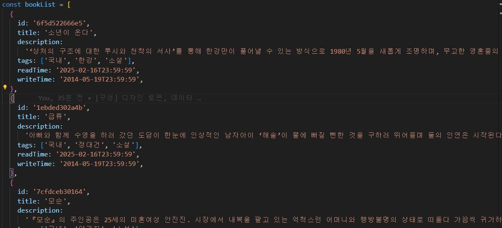
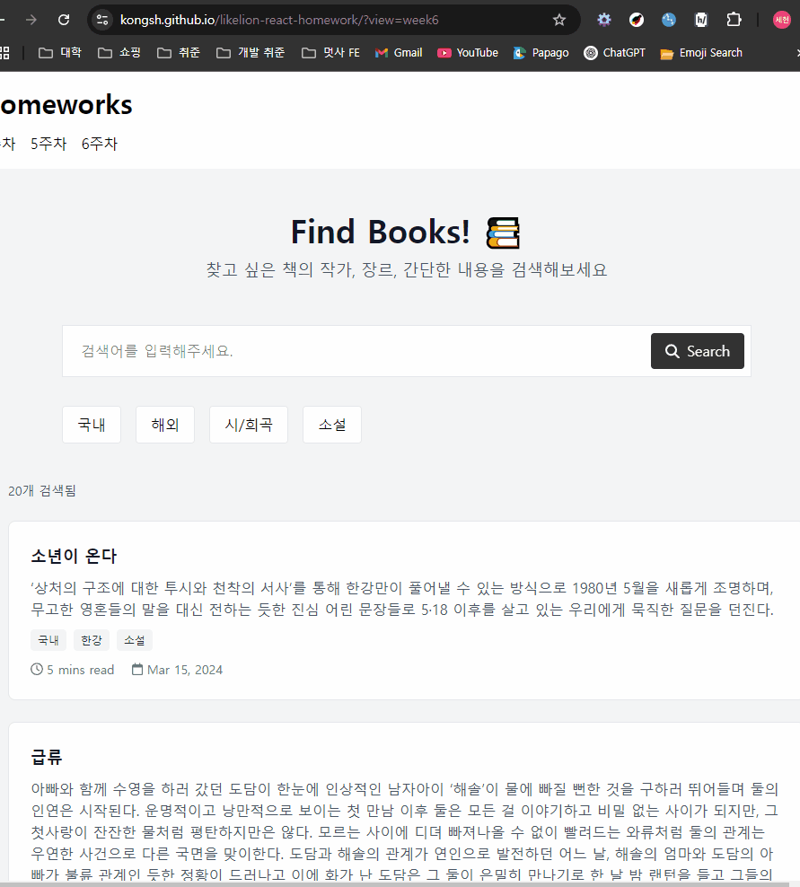

# 카드 검색 리스트 UI

멋사 프론트엔드 스쿨 12기 공세현의 6주차 과제 문서입니다.😀

- [🔗카드 검색 리스트 UI 배포 링크](https://kongsh.github.io/likelion-react-homework/?view=week6)

## 📝 목차

- [설계](#설계)
  - [데이터](#데이터)
- [과정](#과정)
- [결과물](#결과물)
- [후기](#후기)

## 설계



- 강의 시간에 알려주신 사이트 중 [creatie.ai](https://creatie.ai/) 사이트를 활용해 간단한 UI를 만들어 보았고, `main` 부분을 개발하기로 했습니다.
- <span style="color:red">SearchForm</span>, <span style="color:green">SearchList</span>를 포함하는 `SearchPage`(`index.tsx`)에서 상태(`query`)를 관리합니다.
- <span style="color:red">SearchForm</span>의 하위 컴포넌트로 <span style="color:yellow">SearchCheckBox</span>를, <span style="color:green">SearchList</span>의 하위 컴포넌트로 <span style="color:skyblue">Card</span>를 사용해 각각 리스트 렌더링을 수행 할 계획입니다.

---

### 데이터



- 검색해 볼 데이터로는 여러 후보(음식, 음악, 여행지 등)가 있었지만, 장르, 국가 별 태그 버튼을 잘 활용해 볼 수 있는 도서 데이터를 만들어 사용하기로 했습니다.

## 과정

```ts
function SearchCheckBox({ tag, words, handleCheck }: SearchCheckBoxProps) {
  const checked = words.includes(tag);

  return (
    <label
      className={tm(
        'cursor-pointer',
        'inline-flex gap-1 items-center',
        'bg-white px-4 py-2 border border-search-gray-200 rounded-sm',
        'has-checked:bg-black has-checked:text-white',
        'has-focus:outline-1'
      )}
    >
      <input
        type="checkbox"
        className="sr-only"
        checked={checked}
        onChange={handleCheck}
      />
      {tag}
    </label>
  );
}
```

- `Tab`키 접근성과 `input`의 체크 상태에 따른 `label`의 스타일링에 어려움을 겪었었는데, `tailwindcss`의 공식 문서에서 `has-**:`를 최신 버전 부터 지원한다는 사실을 배웠고 `SearchCheckBox` 컴포넌트에 적용해 문제를 해결할 수 있었습니다.

## 결과물



- 카드 검색 리스트 UI를 구현 완료했습니다.

## 후기

- 강의 시간에 배웠던 `useEffect`, `query parameter, popstate`를 활용한 렌더링 및 로직, React 19버전부터 추가된 `form`의 `action`의 기능 등 많은 것들을 복습해 볼 수 있어 좋았습니다.
- 개인 사정 상 과제에 시간을 오래 들이지 못해 계획대로 못만든 기능들(`Card` 컴포넌트에서 데이터가 지닌 시간 값에 따른 렌더링)이 아쉬웠습니다. 😥
- 과제를 진행하며 공식 문서들을 찾아보고 문제를 해결해 뿌듯했습니다.
- 처음으로 [creatie.ai](https://creatie.ai/)를 사용해보았고 생각보다 유용한 툴이라는 생각이 들었습니다.
